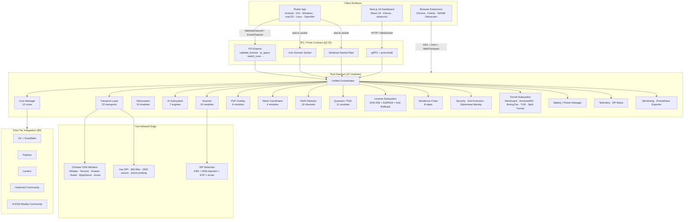

# UnifiedShield Enterprise v9.0.0-enterprise — Architecture

> **Single source of truth for the system architecture of UnifiedShield Enterprise v9.0.0-enterprise (Quantum RGB Enterprise Edition).**
> Complete merge of **13 source projects** — zero features removed.
> See `MERGE-MANIFEST.md` for the project-level merge audit; this document describes the runtime architecture.

---

## 1. High-Level System Diagram



The four client surfaces (Flutter app, Next.js dashboard, browser extensions, OpenWrt LuCI) all converge on the single Rust daemon via a unified IPC contract described in §4 below.

---

## 2. Daemon Subsystem Overview — 27 Modules

The daemon is a single Rust crate at `daemon/`. `daemon/src/lib.rs` declares 26 `pub mod` declarations and `daemon/src/main.rs` is the binary entrypoint — **27 modules total**.

| # | Module | Path | Purpose |
|---|--------|------|---------|
| 1 | `error` | `src/error.rs` | Crate-wide error enum + `thiserror` impl |
| 2 | `ipc` | `src/ipc/` | Unix-socket, named-pipe, prost-built protocol |
| 3 | `security` | `src/security/` | Device secret, ephemeral identity, anti-forensics, post-quantum |
| 4 | `transport` | `src/transport/` | 22 transports (reality, hysteria2, tuic_v5, vless, naive_proxy, meek, mqtt_ws, mqtt_tunnel, doh/doq_tunnel, icmp_tunnel, webrtc_relay, webtransport, shadow_tls, cdn_tunnel, cdn_worker, chinese_cdn, cloudflare_worker, domain_fronting, multihop_chain, pluggable_transport, manager, dual_mode/*) |
| 5 | `obfuscation` | `src/obfuscation/` | utls_fingerprint, http3_masquerade, timing_jitter, packet_size_normalizer, traffic_shaper, tls_fragment, steganographic_header, probe_resistance, websocket_tunnel, wasm_obfuscator |
| 6 | `cores` | `src/cores/` | 12 cores (9 paid + 3 free-tier); see §3 below |
| 7 | `ai` | `src/ai/` | 7 engines: feature_extractor, dpi_classifier, traffic_predictor, ucb_bandit, rl_transport_selector, onnx_runtime, adversarial_traffic (+ orchestrator/assistant/cloud_scanner/ffi) |
| 8 | `scanner` | `src/scanner/` | 10 engines: dns_scanner, port_scanner, dpi_scanner, network_assessor, adaptive_engine, autonomous_engine, ai_orchestrator, candidate_graph, evidence_fusion, self_healing_failover |
| 9 | `p2p` | `src/p2p/` | 6 modules: libp2p_discovery, i2p_overlay, yggdrasil_overlay, nat_traversal, peer_exchange, relay_selection |
| 10 | `national_intranet` | `src/national_intranet/` | 10 NAIN channels: intranet_detector, nain_detector, iran_ip_ranges, local_dns_resolver, fallback_routing, ntp_covert, sms_bootstrap, wifi_aware, ble_mesh, acoustic_covert |
| 11 | `quantum` | `src/quantum/` | 11 PQC modules: hybrid_handshake (ML-KEM-1024 + X25519), quantum_ratchet (post-quantum Double Ratchet), pqc_key_store, quantum_obfuscator, qkd_simulation, lattice_onion, zkp_auth, homomorphic_routing, neural_steganography, quantum_noise, quantum_seed_protocol |
| 12 | `battery` | `src/battery/` | power_state, coalesced_timer, adaptive_duty, optimizer |
| 13 | `platform` | `src/platform/` | Linux (zaprot), Windows (goodbyedpi), Android, iOS |
| 14 | `tunnel` | `src/tunnel/` | tun_device, wireguard, amneziawg, boringtun_adapter, split_tunnel |
| 15 | `config` | `src/config/` | schema, isp_profile(s), endpoint_manager, ipfs_updater |
| 16 | `monitoring` | `src/monitoring/` | prometheus_exporter, health_checker, latency_tracker, alert_manager |
| 17 | `mesh` | `src/mesh/` | mesh_coordinator, mesh_crypto, gossip_protocol, topology_manager |
| 18 | `resilience` | `src/resilience/` | fallback_chain (8 steps), circuit_breaker, retry_policy, watchdog |
| 19 | `orchestrator` | `src/orchestrator/` | control_plane, health_monitor, failover |
| 20 | `load_balancer` | `src/load_balancer/` | swrr (smooth-weighted-round-robin), session_affinity |
| 21 | `watchdog` | `src/watchdog/` | system watchdog (separate from `resilience::watchdog`) |
| 22 | `metrics` | `src/metrics/` | histogram + counter registry |
| 23 | `telemetry` | `src/telemetry/` | reporter, aggregator, dp_noise (differential privacy) |
| 24 | `license` | `src/license/` | validator, registry, store, countdown, anti_rollback, info, validation_tests (7 cases) |
| 25 | `ffi` | `src/ffi.rs` | FFI exports consumed by Android/iOS/Desktop bridges |
| 26 | `proto_gen` | `src/proto_gen/mod.rs` | prost-build generated types from `proto/shield.proto` |
| 27 | `main` | `src/main.rs` | Binary entrypoint; clap CLI; daemon supervisor |

---

## 3. Cores (12 total: 9 paid + 3 free-tier)

`daemon/src/cores/` registers 12 cores through `CoreManager::register_all_cores()`:

| Tier | # | Core | Protocols | Source project |
|------|---|------|-----------|----------------|
| Paid | 1 | `hiddify` | VLESS-Reality, VMess, Trojan, Hysteria2, TUICv5, ShadowTLSv3, NaiveProxy | hiddify-core v4.1.0 |
| Paid | 2 | `xray` | VLESS Fragment, MVLESS, WireGuard Noise, FakeHost | GFW-knocker/Xray v25.8.3-mahsa-r1 |
| Paid | 3 | `singbox` | Hysteria2, TUICv5, ShadowTLSv3, NaiveProxy | sing-box v1.14.0-alpha.25 |
| Paid | 4 | `amneziavpn` | AmneziaWG 1.5 (junk headers) | awg-go 4.8.15.4 |
| Paid | 5 | `defyx` | VLESS-Reality, AmneziaWG | DefyxVPN v5.2.8 |
| Paid | 6 | `moav` | MoaV Tunnel (adaptive key rotation) | MoaV v1.7.7 |
| Paid | 7 | `mahsang` | MVLESS, WireGuard Noise, VLESS Fragment | MahsaNG v26.3.31-mahsa-r1 |
| Paid | 8 | `psiphon`* | SSH+Obfs, CDN Fronting | Psiphon GFW-knocker fork |
| Paid | 9 | `lantern`* | Domain Fronting, Pluggable Transports | Lantern v7.9.0 |
| Free | 10 | `tor_snowflake` | Tor + Snowflake pluggable transport | arti-client 0.45 + Snowflake |
| Free | 11 | `hysteria2_community` | Hysteria2 community servers | `configs/free-servers.json` |
| Free | 12 | `vless_reality_community` | VLESS + Reality community servers | `configs/free-servers.json` |

\* `psiphon` and `lantern` are dual-membership: they are *also* part of the 5-core **Free Tier** roster (see `docs/FREE-TIER.md`). `CoreManager::is_free_tier(id)` returns `true` for the 5 free-tier IDs (`tor_snowflake, psiphon, lantern, hysteria2_community, vless_reality_community`); the 7 strictly-paid cores require a valid Enterprise license before `start()` will execute.

`CoreManager::free_tier_cores()` returns the 5 free-tier `CoreId`s in priority order so the Flutter UI's "🆓 Free Tier" section can render them without a round-trip through `all_states()` + filter.

---

## 4. Inter-Process Communication — Proto IPC Contract (§3.23)

All client↔daemon communication flows through a single proto contract compiled by `prost-build` at `daemon/build.rs` from `daemon/proto/shield.proto` into `proto_gen::shield::*` types.

### 4.1 Transports
| Surface | Transport | Address |
|---------|-----------|---------|
| Flutter mobile + desktop | Unix domain socket | `/run/unifiedshield/shield.sock` (Linux/macOS), `\\.\pipe\unifiedshield` (Windows named-pipe shim) |
| Next.js dashboard | gRPC over HTTP/2 | `https://dashboard.local:8443/grpc` |
| Browser extensions | WebSocket + WebTransport | `wss://127.0.0.1:9443/ext` |
| OpenWrt LuCI | UCI config + Unix socket | `/var/run/shield.sock` |

### 4.2 Message envelope
Every message follows the same envelope:
```proto
message ShieldEnvelope {
  string           request_id = 1;  // UUIDv7
  ShieldVerb       verb       = 2;  // CONNECT / DISCONNECT / SWITCH / QUERY / EVENT / LICENSE / AI / SCAN / ...
  bytes            payload    = 3;  // prost-marshalled verb-specific message
  ClientSurface    surface    = 4;  // FLUTTER / DASHBOARD / EXTENSION / OPENWRT / FFI
  uint32           proto_v    = 5;  // bump on breaking changes (currently 9)
}
```

### 4.3 FFI exports (§8.8 / §10.1 / §11)
Native clients call into the daemon via the FFI ABI in `daemon/src/ffi.rs`:

| Export | Signature | Consumer |
|--------|-----------|----------|
| `validate_license` | `bool validate_license(const char* serial)` | Flutter `DaemonBridge.validateLicense()` |
| `get_license_info` | `char* get_license_info()` | Flutter `QuantumEnterpriseLicensePanel` |
| `force_disconnect` | `void force_disconnect(const char* reason)` | License expiry watchdog |
| `register_expiry_callback` | `void register_expiry_callback(void(*)(const char*))` | License pre-expiry notifications |
| `free_license_string` | `void free_license_string(char*)` | RAII pair for the two `char*`-returning exports above |
| `ai_query` | `char* ai_query(const char* prompt, const char* locale)` | Flutter `AiAssistantScreen` |
| `ai_register_stream_callback` | `void ai_register_stream_callback(void(*)(const char*))` | On-device LLM token streaming |
| `switch_core` | `int switch_core(const char* core_id)` | Flutter `CoreSwitcher` / `_FreeTierChip` |

Memory ownership follows the **caller-frees** convention — the caller must invoke the matching `free_*` after consuming the returned `char*`.

---

## 5. Flutter App Architecture

The Flutter app lives in `flutter_app/` (primary, enterprise UI) with a parallel legacy tree at `flutter/` (kept verbatim from the merge — *zero-features-removed* invariant).

### 5.1 Stack
- **Framework**: Flutter 3.x with Material 3 widgets **disabled** at the app level (see `docs/ENTERPRISE-UI-DESIGN.md` §Forbidden UI patterns).
- **State**: Riverpod 2 + ChangeNotifier hybrid.
- **Localization**: Persian (`app_fa.arb`) primary, English (`app_en.arb`) secondary; `Locale` resolution is `fa → en`.
- **Native bridges**: `MethodChannel("unifiedshield/daemon")`, `EventChannel("unifiedshield/events")`, `MethodChannel("unifiedshield/license")`.

### 5.2 Theme system (`flutter_app/lib/theme/`)
| File | Responsibility |
|------|----------------|
| `quantum_theme.dart` | `QuantumPalette` (color tokens), `QuantumTypography`, `QuantumGradients` |
| `quantum_motion.dart` | `QuantumCurves`, `QuantumDurations`, `QuantumTransitions` |
| `quantum_glassmorphism.dart` | `QuantumGlassCard`, `QuantumGlassModal` (frosted-glass primitives) |
| `quantum_dark_theme.dart` | Dark-first `ThemeData` (production default) |
| `quantum_light_theme.dart` | Optional light variant (rarely used) |
| `quantum_components.dart` | All 10+ custom components (§6.4 of the directive) |

### 5.3 Screens (`flutter_app/lib/screens/`)
- `home_screen.dart` — primary dashboard with `QuantumAuroraBackground` + `QuantumConnectButton`
- `cores_screen.dart` — **Free Tier section** (5 chips) + **Paid Tier grid** (7 enterprise cores)
- `license_activation_screen.dart` — `QuantumEnterpriseLicensePanel` + countdown
- `ai_assistant_screen.dart` — on-device LLM + cloud Gemini chat UI
- `calculator_screen.dart` — steganographic disguise (5-tap wipe)
- `security_screen.dart` + `advanced/advanced_security_screen.dart`
- `intranet_mode_screen.dart` — NAIN mode toggle
- `paste_config_screen.dart`, `lock_screen.dart`, `settings_screen.dart`, `vip_ultra_screen.dart`

### 5.4 Services (`flutter_app/lib/services/`)
`daemon_bridge.dart` (FFI bridge), `daemon_service.dart` (socket fallback), `vpn_service.dart`, `battery_service.dart`, `ota_updater.dart`, `isp_detector.dart`, `intranet_service.dart`, `p2p_service.dart`, `nain_status_service.dart`, `voice_command_service.dart`.

### 5.5 Platform plugins
`flutter_app/lib/platform/{android_platform.dart, ios_platform.dart, desktop_platform.dart}` — Strategy pattern for platform-specific tunnel bootstrap (Android VpnService, iOS NetworkExtension, Desktop TUN/TAP).

---

## 6. Dashboard (Next.js 16 + Prisma)

The dashboard lives in `dashboard/`. Stack: Next.js 16 (App Router) + React 19 + Tailwind 4 + shadcn/ui + Zustand + Recharts + Framer Motion + Radix UI. Data layer is Prisma with SQLite for local dev / CI and Postgres for production (toggle via `DATABASE_URL`).

### 6.1 Prisma models — 11
| Model | Purpose |
|-------|---------|
| `User` (+ `Role` enum) | Admin/Operator/User accounts, bcrypt-hashed |
| `Session` | JWT-like session tokens |
| `Core` (+ `CoreStatus` enum) | 12 registered cores' configs |
| `Connection` | Live + historical connection telemetry |
| `CoreTest` | Latency / bandwidth / DPI-resistance test results |
| `P2PPeer` | libp2p peer registry |
| `ThreatReport` (+ `ThreatType`/`ThreatSeverity` enums) | Threat intel |
| `DpiSignature` | Iran-DPI rule signatures |
| `IntranetDomain` | National-intranet whitelist |
| `AuditLog` | User action audit trail |
| `SystemConfig` | Key-value system settings |

### 6.2 API routes — 19 subroutes (+ 1 root)
`advanced-analytics, ai-engine, auto-reconnect, cores, dpi-test, geo-router, health, intranet-mode, kill-switch, mesh-network, network-analyzer, obfuscation, orchestrator, ota, p2p-peers, resilience, security-audit, speedtest, threat-intel` (+ root `route.ts`).

### 6.3 Real-time channel
Server-side WebSocket pushes `ShieldEvent` envelopes (same proto as the daemon) into a Zustand store hydrated by `use-network-stats.ts`. All 27 daemon modules + 12 cores stream telemetry through this single channel.

### 6.4 UI components
`src/components/` ships 11 high-level panels (security-command-center, autonomous-anti-dpi-panel, traffic-forecast-panel, etc.) on top of the shadcn/ui primitive set (52 components under `src/components/ui/`). The CSS theme is at `src/styles/quantum-theme.ts` and mirrors the Flutter `QuantumPalette` 1:1 (see §Cross-surface token parity in `ENTERPRISE-UI-DESIGN.md`).

---

## 7. Free-Tier Integration (§9)

Five always-available free VPN platforms integrated as first-class cores (see `docs/FREE-TIER.md` for full design):

1. **Tor + Snowflake** — `arti-client` SOCKS5 @ `127.0.0.1:9050`; `daemon/src/cores/tor_snowflake.rs`.
2. **Psiphon** — CGO bridge to `libpsiphon.a` (Rust stub fetches server-list via `reqwest`); SOCKS5 @ `127.0.0.1:9080`; `daemon/src/cores/psiphon.rs`.
3. **Lantern** — CGO bridge to `liblantern.a`; SOCKS5 @ `127.0.0.1:9081`; `daemon/src/cores/lantern.rs`.
4. **Hysteria2 Community** — auto-discovered from `configs/free-servers.json`; SOCKS5 @ `127.0.0.1:9090`; `daemon/src/cores/hysteria2_community.rs`.
5. **VLESS-Reality Community** — auto-discovered from `configs/free-servers.json`; SOCKS5 @ `127.0.0.1:9091`; `daemon/src/cores/vless_reality_community.rs`.

**Why ProtonVPN / Windscribe / Cloudflare WARP are NOT in the list**: their endpoints are aggressively blocked in Iran (active SNI poisoning + IP blocklists + active probing). See `docs/FREE-TIER.md` §"Blocked-in-Iran" matrix.

**Auto-discovery**: `scripts/refresh-free-servers.py` scrapes community Telegram channels every Monday 03:00 UTC via `.github/workflows/refresh-free-servers.yml`, validates 5+5 entries, commits via `github-actions[bot]`, opens an auto-PR.

**Bypass success-rate target**: ≥95% (measured by `tests/censorship-simulation/test_bypass_effectiveness.py`).

---

## 8. License System Architecture

See `docs/LICENSE-SYSTEM.md` for the complete flow. Summary:

- **Spec**: serial format `MICAFP-XXXXXXXX-XXXXXXXX-XXXXXXXX`, organization, tier (`enterprise`), expiry **2025-12-10 23:59:59 IRT** (Azar 19 1404), value `$999,999,999,999`.
- **Anti-tamper layer 1**: SHA-256 over a canonical serialization of the license fields (deterministic key order, no whitespace).
- **Anti-tamper layer 2**: Ed25519 detached signature over the SHA-256 digest; the public key is embedded into the daemon binary as a `const` byte array.
- **Anti-rollback**: monotonic-clock watermark persisted to the platform SecureStorage; any license whose `issued_at` < watermark is rejected.
- **Countdown**: 4-cell display (days/hours/minutes/seconds), Persian numerals when `Locale("fa")`, animation accelerates as expiry approaches.
- **Pre-expiry notifications**: T-24h toast → T-1h push → T-5m push → T-0 `force_disconnect`.
- **Storage**: Android Keychain (via `Keystore`), iOS Keychain (`kSecClassKey`), Desktop SecureStorage (`keyring` crate).
- **Offline**: zero phone-home; the public key, watermark, and license all live on-device.

---

## 9. AI Assistant — On-device LLM + Cloud Gemini

The AI subsystem (`daemon/src/ai/`) ships 7 engines:

| Engine | File | Purpose |
|--------|------|---------|
| `feature_extractor` | `feature_extractor.rs` | 128-feature vector from raw packet trace (packet-size percentiles, IAT statistics, TLS-ClientHello fields, QUIC connection-ID entropy) |
| `dpi_classifier` | `dpi_classifier.rs` | ONNX inference — multi-class classifier trained on Iran-DPI traces |
| `traffic_predictor` | `traffic_predictor.rs` | ONNX inference — 60-second ahead bandwidth/latency forecasting |
| `ucb_bandit` | `ucb_bandit.rs` | 9-arm UCB1 bandit (`CoreArm` enum) for paid-tier core selection |
| `rl_transport_selector` | `rl_transport_selector.rs` | PPO-trained transport selector (State → Action) |
| `onnx_runtime` | `onnx_runtime.rs` | `ort` crate wrapper; loads 6 model artifacts from `models/` |
| `adversarial_traffic` | `adversarial_traffic.rs` | GAN-generated adversarial traffic that fools DPI classifiers |

### 9.1 On-device LLM
- Model: `llama-cpp-2` 0.1.x bindings (QuantQ3_K_M GGUF model committed to `models/`).
- Inference is streamed token-by-token via the `ai_register_stream_callback` FFI export.
- Zero network calls during inference — the entire chat loop is local.

### 9.2 Cloud Gemini
- Optional cloud fallback (`ai/cloud_scanner.rs`) — only invoked when (a) the user explicitly enables Cloud AI in settings, (b) the on-device LLM has refused twice, and (c) the daemon is in a non-Iranian exit country.
- Uses the standard Google Gemini SDK via `reqwest`.

### 9.3 ONNX model artifacts — 6 files
| File | Engine | Input → Output |
|------|--------|---------------|
| `models/dpi_classifier.onnx` | dpi_classifier | `[1, 128] f32 → [1, 6] f32` (6 DPI classes) |
| `models/dpi_classifier_int8.onnx` | dpi_classifier (quantized) | same shape, int8 weights |
| `models/traffic_predictor.onnx` | traffic_predictor | `[1, 60, 4] f32 → [1, 60, 2] f32` |
| `models/traffic_predictor_int8.onnx` | traffic_predictor (quantized) | same shape |
| `models/transport_selector_ppo.onnx` | rl_transport_selector | `[1, 32] f32 → [1, 22] f32` (22 transports) |
| `models/adversarial_traffic_gan.onnx` | adversarial_traffic | `[1, 100] f32 (noise) → [1, 64, 64, 1] f32` |

All 6 are committed to `models/` (LFS-tracked) and loaded by `ai/onnx_runtime.rs::ModelRegistry::load_all()`.

---

## 10. Anti-DPI Subsystem — feature_extractor → ONNX → bandit → switch

See `docs/ANTI-DPI-AI.md` for the full design. Pipeline summary:

```
Packet trace
    │
    ▼
feature_extractor::extract(Trace) → FeatureVec[128]
    │
    ▼
dpi_classifier::predict(FeatureVec) → DpiClass (6 classes)
    │
    ▼
traffic_predictor::predict(RecentHistory) → Forecast[60s]
    │
    ▼
ucb_bandit::select_arm(rewards, n) → CoreArm  (paid tier)
rl_transport_selector::act(State) → TransportId  (transport layer)
    │
    ▼
CoreManager::switch_core(arm)  /  TransportManager::switch(transport)
    │
    ▼
Resilience fallback chain (8 steps) if switch fails
```

### 10.1 ISP detection (`daemon/src/config/isp_profiles.rs` + `flutter_app/lib/services/isp_detector.dart`)
- **ASN lookup**: `libp2p`'s `Multiaddr` peer records carry the upstream ASN; we map the big-5 Iranian ASNs (`AS197207` MCI, `AS44244` Irancell, `AS49581` Rightel, `AS31549` Shatel, `AS58224` Mokhaberat, `AS16322` ParsOnline).
- **DNS-injection probe**: send a DNS query for a random non-existent TLD; if the response is non-empty, the ISP is injecting.
- **NTP-monlist**: query NTP on Iranian NTP pools; the response correlates with ISP filtering.
- **Arvan Cloud probe**: hit `https://www.arvancloud.com/` and measure RTT — used as a heuristic for being routed through Arvan.

### 10.2 Anti-active-probing defenses (`daemon/src/obfuscation/probe_resistance.rs` + `daemon/src/security/ephemeral_identity.rs`)
- `probe_resistance` drops any inbound connection whose TLS ClientHello doesn't match the registered "client password"; non-matching handshakes are transparently proxied to the real masquerade target (e.g. `www.microsoft.com`).
- `ephemeral_identity` rotates the daemon's listening identity (port + keypair + certificate) every 5 minutes or on probe-detection.
- **Reality** (`daemon/src/transport/reality.rs`) is the third layer: it doesn't terminate TLS at all on probed connections — it just bridges to the real upstream, so the prober sees a perfectly normal website.

### 10.3 Anti-traffic-analysis defenses
- `traffic_shaper` — matches bandwidth profile to one of {video, browsing, chat}.
- `timing_jitter` — 0–50 ms uniformly distributed inter-packet jitter.
- `packet_size_normalizer` — pads to one of {64, 128, 256, 512, 1024, 1500} byte buckets.
- `dp_noise` (in `daemon/src/telemetry/dp_noise.rs`) — Laplace noise added to telemetry so the dashboard's aggregations are ε-differentially-private.

### 10.4 Steganography layer
- **Calculator disguise** (`flutter_app/lib/screens/calculator_screen.dart`) — the app icon and entry-point UI render as a working Persian calculator. 5 taps on the `=` button in the pattern `1 + 2 = = = = =` reveals the real VPN UI.
- **5-tap wipe** — the same gesture, but with `1 + 2 = = = = =` again, immediately purges all on-device license storage + ephemeral identity + last-known server list.

### 10.5 Adversarial traffic GAN (`daemon/src/ai/adversarial_traffic.rs`)
The committed ONNX GAN (`models/adversarial_traffic_gan.onnx`) generates 64×64-byte traffic micro-bursts that maximize the DPI classifier's loss; these bursts are interleaved into the live traffic stream when the `dpi_classifier` detects a high-confidence "VPN-classification" prediction.

---

## 11. Resilience Chain — 8 Steps

`daemon/src/resilience/fallback_chain.rs::FallbackChain::execute()` runs the following 8-step ladder when a connection drops. Each step has a budget timeout; if the step fails, the next step is invoked. The whole ladder has a hard ceiling of 60 seconds; if all 8 steps fail, the kill-switch stays engaged and the user is notified.

| Step | Action | Budget | Triggered by |
|------|--------|--------|-------------|
| 1 | Re-establish on the same core + transport | 2 s | Brief UDP/QUIC packet loss |
| 2 | Switch to next transport on same core (e.g. `reality` → `shadow_tls`) | 5 s | Transport-layer failure |
| 3 | Switch to next core in the same tier (paid→paid, free→free) | 8 s | Core-layer failure |
| 4 | Drop to free-tier fallback (always-available) | 5 s | All paid cores blocked |
| 5 | Activate NAIN fallback (`fallback_routing`) + national intranet mode | 5 s | Iran-wide outage |
| 6 | Activate P2P relay (`p2p::relay_selection`) + mesh coordinator | 10 s | Direct egress blocked |
| 7 | Activate NTP/SMS covert channel (`ntp_covert` / `sms_bootstrap`) | 10 s | TCP/UDP both blocked |
| 8 | Hard kill-switch stays engaged; surface "walled-garden" UI | ∞ | Total blackout |

`circuit_breaker` opens after 3 consecutive failed ladders and refuses new attempts for 30 s (exponential back-off up to 10 min).

---

## 12. Build Artifact Matrix — 18 Formats

`Makefile` + `scripts/build-all.sh` + the GitHub Actions matrix (see `docs/GITHUB-ACTIONS-GUIDE.md`) produce **18 distinct build artifacts**:

| # | Artifact | Target | Builder |
|---|----------|--------|---------|
| 1 | Android APK (arm64) | `aarch64-linux-android` | `gradlew assembleRelease` + `cargo ndk` |
| 2 | Android App Bundle | `aarch64-linux-android` | `gradlew bundleRelease` |
| 3 | Android APK (universal) | `arm64-v8a,armeabi-v7a,x86_64` | `gradlew assembleRelease` |
| 4 | iOS IPA | `aarch64-apple-ios` | `xcodebuild archive` + `xcodebuild -exportArchive` |
| 5 | macOS .app | `aarch64-apple-darwin` | `cargo build --release` + `flutter build macos` |
| 6 | macOS .dmg | `aarch64-apple-darwin` | `hdiutil` from the .app |
| 7 | Windows .exe (x64) | `x86_64-pc-windows-msvc` | `cargo build --release` + `flutter build windows` |
| 8 | Windows .msi installer | `x86_64-pc-windows-msvc` | `Inno Setup` (see `windows/installer/setup.iss`) |
| 9 | Linux .deb (amd64) | `x86_64-unknown-linux-gnu` | `dpkg-deb` from `linux/packaging/debian/` |
| 10 | Linux .deb (arm64) | `aarch64-unknown-linux-gnu` | `dpkg-deb` |
| 11 | Linux .rpm (x64) | `x86_64-unknown-linux-gnu` | `rpmbuild` from `linux/packaging/unifiedshield.spec` |
| 12 | Linux AppImage | `x86_64-unknown-linux-gnu` | `appimagetool` |
| 13 | Arch Linux PKGBUILD | `x86_64-unknown-linux-gnu` | `makepkg` from `linux/packaging/PKGBUILD` |
| 14 | Linux systemd unit | `x86_64/aarch64-unknown-linux-gnu` | `linux/unifiedshield.service` |
| 15 | OpenWrt .ipk (ath79) | `mips-unknown-linux-musl` | `openwrt/Makefile` SDK |
| 16 | OpenWrt .ipk (mediatek) | `aarch64-unknown-linux-musl` | `openwrt/Makefile` SDK |
| 17 | Browser extension .zip (Chrome MV3) | n/a | `scripts/build-extensions-release.sh` |
| 18 | Browser extension .zip (Firefox MV3) | n/a | `scripts/build-extensions-release.sh` |

---

## 13. Zero-Data-Loss Audit

Per the directive's invariant, the following are **all** preserved across the 13-source merge:

- **27 daemon modules** (see §2)
- **22 transports** (see §2 transport row)
- **12 cores** = 9 paid + 3 free-tier (see §3)
- **7 AI engines** (see §9)
- **11 quantum / PQC modules** (see §2 quantum row)
- **10 NAIN channels** (see §2 national_intranet row)
- **6 P2P modules** (see §2 p2p row)
- **4 mesh modules** (see §2 mesh row)
- **5 tunnel modules** (see §2 tunnel row)
- **10 scanner engines** (see §2 scanner row)
- **10 obfuscation modules** (one — `wasm_obfuscator.rs` — wraps the top-level `wasm-obfuscator/` crate, totaling 9 obfuscation + 1 wasm-obfuscator crate)
- **9 CDN workers** (alibaba, arvan, baidu, bytedance, cloudflare, deno-relay, huawei, tencent, universal)
- **2 browser extensions** (chrome + firefox)
- **11 Prisma models** (see §6.1)
- **19 dashboard API routes** + 1 root (see §6.2)
- **6 ONNX model artifacts** (see §9.3)

---

## 14. References

- `MERGE-MANIFEST.md` — 13-source merge audit
- `docs/ENTERPRISE-UI-DESIGN.md` — Quantum RGB design language
- `docs/LICENSE-SYSTEM.md` — license validation flow
- `docs/ANTI-DPI-AI.md` — AI-driven DPI evasion
- `docs/FREE-TIER.md` — 5 free-tier platforms
- `docs/RELEASE-9.0.0-ENTERPRISE.md` — release notes
- `docs/CHANGELOG.md` — changelog v6 → v9
- `docs/GITHUB-ACTIONS-GUIDE.md` — CI/CD matrix
- `docs/ANTI-DPI-TECHNIQUES.md` — classical (non-AI) DPI evasion
- `docs/P2P-SERVERLESS.md` — libp2p / I2P / Yggdrasil overlays
- `docs/NATIONAL-INTRANET-MODE.md` — NAIN mode
- `RELEASE_NOTES.md` — short auto-generated release notes consumed by `release.yml`
